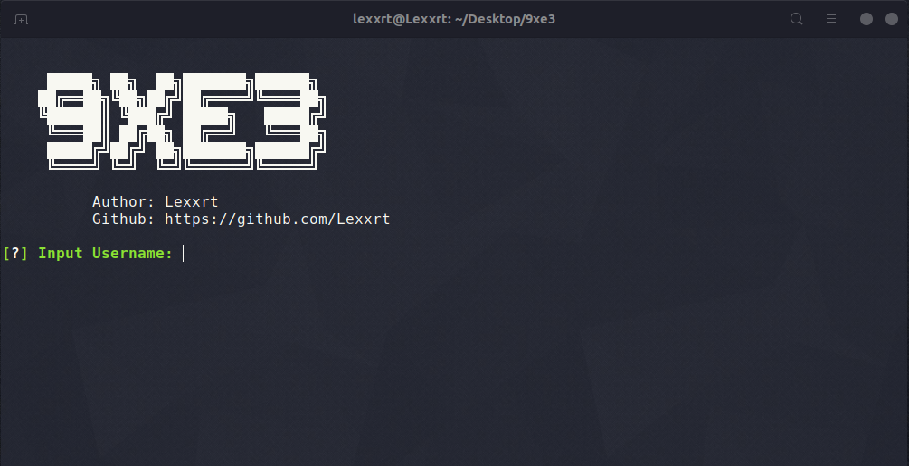

## 9xe3

*Usage:*

1. Convert to executable: `chmod +x ./9xe3.sh` 📂
2. Run 9xe3 (Windows): `dos2unix ./9xe3 && ./9xe3.sh` 🚀
3. Run 9xe3 (Linux/Mac): `./9xe3.sh` 🚀

> 

*Social Media Sites (75 Sites):* 📱

- Instagram
- Facebook
- Twitter
- Youtube
- Blogger
- Gloogle plus
- Reddit
- Wordpress
- Pinterest
- Github
- Tumblr
- Flickr
- Steam
- Vimeo
- Soundcloud
- Disqus
- Medium
- Deviantart
- Vk
- About.me
- Imgur
- Flipboard
- Slideshare
- Fotolog
- Spotify
- Mixcloud
- Scribd
- Badoo
- Bitbucket
- Dailymotion
- Etsy
- Cashme
- Behance
- Goodreads
- Instructables
- Keybase
- Kongregate
- Livejournal
- Angellist
- Last.fm
- Dribbble
- Codecademy
- Gravatar
- Pastebin
- Foursquare
- Roblox
- Gumroad
- Newgrounds
- Wattpad
- Canva
- Creativemarket
- Trakt
- 500px
- Buzzfeed
- Tripadvisor
- Hubpages
- Contently
- Houzz
- Blip.fm
- Wikipedia
- Hackernews
- Codementor
- Reverbnation
- Designspiration 65
- Bandcamp
- Colourlovers
- Ifttt
- Ebay
- Slack
- Okcupid
- Trip
- Ello
- Tracky
- Tripit
- Basecamp

